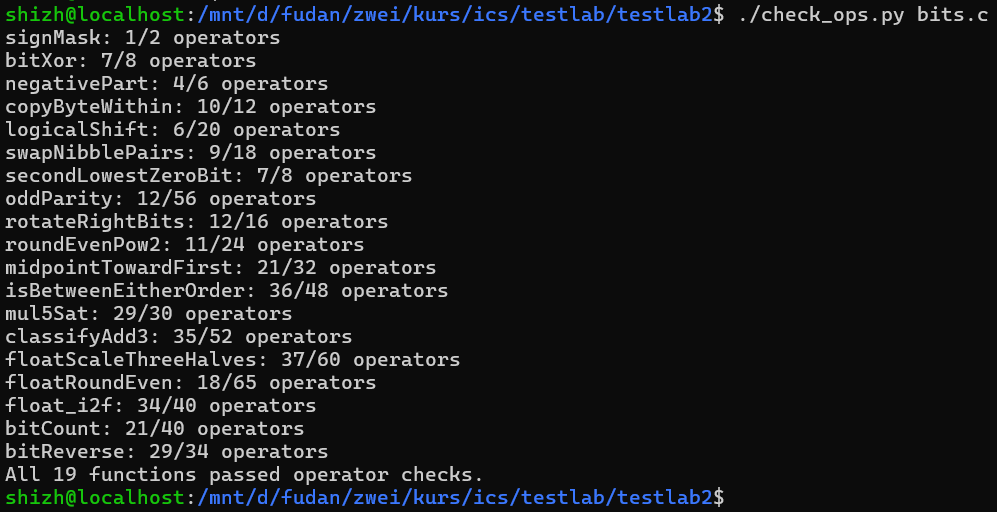
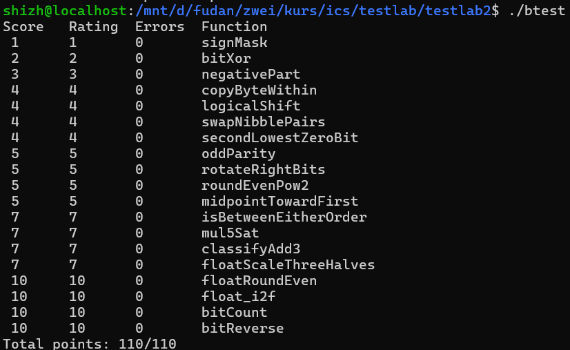

# Lab1: Data Lab 实验报告

**课程**：计算机系统基础（ICS，2026 年秋季学期）

**姓名**：（请填写）

**学号**：（请填写）

## 一、测试结果

### 1. 规则检查 `./check_ops.py bits.c`

19 题全部通过运算符与操作数检查（`All 19 functions passed operator checks.`）。

### 2. 正确性测试 `./btest`

19 题 Errors 均为 0，总分 **110/110**。`./test.sh` 一键流程退出码为 0。

## 二、实现思路

> 整数题采用 32 位补码模型：`>>` 为算术右移，加减与左移按 32 位位向量解释（溢出丢弃高位），移位量保持在 0–31。所有"减去常数/取负数"都通过 `+ ~x + 1` 或 `x + ~0` 实现，避免使用禁用的 `-`。

### P1 signMask（1 分）

`1 << 31` 把 1 移到最高位，即为 0x80000000。

### P2 bitXor（2 分）

利用恒等式 `x ^ y = (x | y) & ~(x & y)`，再用德摩根律消去 `|`：
`x ^ y = ~(~x & ~y) & ~(x & y)`，只使用 `~` 和 `&`。

### P3 negativePart（3 分）

`x >> 31` 借算术右移得到符号掩码：x < 0 时为全 1，否则为全 0。
`~x + 1` 即 `-x`。两者相与：负数返回 `-x`，非负返回 0。

### P4 copyByteWithin（4 分）

把 x 右移 `src*8` 位后 `& 0xFF` 取出源字节；把 `0xFF` 左移 `dst*8` 位得到目标掩码。
`(x & ~mask) | (byte << (dst*8))` 清空目标字节后写入源字节。

### P5 logicalShift（4 分）

先做算术右移 `x >> n`，再用掩码 `~(((1 << 31) >> n) << 1)` 清掉高 n 位的符号扩展，
即得到逻辑右移。（n=0 时掩码为全 1，n=31 时掩码为 1，均正确。）

### P6 swapNibblePairs（4 分）

构造掩码 `0x0F0F0F0F`（`0x0F` 复制四次），
`((x & m) << 4) | ((x >> 4) & m)` 把每个字节内高低半字节交换。

### P7 secondLowestZeroBit（4 分）

x 中最低的 0 位就是 `~x` 中最低的 1 位，即 `~x & (x + 1)`。
把该位在 x 中置 1（`x | low`）后，再用同法取一次，即得第二低的 0 位；
不足两个 0 位时结果为 0。

### P8 oddParity（5 分）

用异或折叠把所有位"压"到最低位：`x ^= x>>16; x ^= x>>8; x ^= x>>4; x ^= x>>2; x ^= x>>1`。
折叠后 bit0 为 1 当且仅当 1 的个数为奇数。题目要求"偶数个 1 返回 1"，故返回 `(x & 1) ^ 1`。

### P9 rotateRightBits（5 分）

`m = n & 31` 把移位数归到 0–31。右半部分用算术右移后清符号位
（同 P5 的掩码技巧）实现逻辑右移；左半部分移 `(~m + 1) & 31` 位，
即 `(32 - m) % 32`（m=0 时结果为 0，避免移 32 位）。两半 OR 合并。

### P10 roundEvenPow2（5 分）

设 `q = x >> n`（商）、`half = 2^(n-1)`。
关键观察：`(x + half - 1 + (q & 1)) >> n` 恰好产生正确的进位：
余数大于 half 时 `+half-1` 必然进位；余数恰好等于 half 时，只有 q 为奇数才进位
（round half to even）；余数小于 half 时不进位。最后 `<< n` 还原倍数。

### P11 midpointTowardFirst（5 分）

利用恒等式 `x + y = 2(x & y) + (x ^ y)` 得
`base = (x & y) + ((x ^ y) >> 1) = floor((x+y)/2)`，全程不溢出。
当 `x ^ y` 为奇数（x+y 为奇数）时中点是 *.5：题目要求"偏向第一个参数 x"，
即 x > y 时向上取整。x > y 用防溢出比较实现：符号不同时由符号位直接判定，
符号相同时差值不会溢出，看差值的符号位即可。

### P12 isBetweenEitherOrder（7 分）

x 在 [a,b] 或 [b,a] 内 ⟺ x 不小于较小的端点且不大于较大的端点 ⟺
`!(x<a && x<b) && !(x>a && x>b)`。
每个小于比较都用防溢出版本：`(sx^sy) & sx` 处理符号不同（负数小），
`~(sx^sy) & (x-y 的符号)` 处理符号相同（差值精确）。
`x > a` 表示为 `!lta & !!da`（不小于且不相等）。

### P13 mul5Sat（7 分）

5x 溢出 ⟺ `|x| >= ceil(2^31/5) = 0x1999999A`（由 `0x19/0x99/0x9A` 拼出）。
`|x|` 用无分支技巧 `(x + (x>>31)) ^ (x>>31)` 求得（对 INT_MIN 也正确）。
溢出时按 x 的符号饱和到 INT_MAX 或 INT_MIN（`~(1<<31) + ((x>>31)&1)` 一步选出），
否则返回 `(x << 2) + x`。

### P14 classifyAdd3（7 分）

把三个数的精确和拆成两次加法，每次记溢出标志 o ∈ {-1, 0, 1}
（两正得负记 +1，两负得非负记 -1）。精确和 `S = s2 + (o1 + o2) · 2^32`：
`o1+o2 >= 1` 时 S > INT_MAX 返回 1；`o1+o2 <= -1` 时 S < INT_MIN 返回 -1；
为 0 时 S = s2 必在范围内，返回 0。

### P15 floatScaleThreeHalves（7 分）

拆出符号 s、阶码 e、尾数 f。NaN 与无穷直接返回原值。
非规格化数（e=0）：值为 `f · 2^-149`，×1.5 即对 `3f/2` 做 round-to-nearest-even
（`(m>>1) + ((m&1)&((m>>1)&1))` 处理奇数恰好一半的情形），
结果达到 2^23 时转为最小规格化数（阶码字段 1）。
规格化数：有效数 `(2^23+f)` 乘 3 再按 RNE 除 2；结果达到 2^24 时阶码加 1，
此时若商为奇数（又落在中点）需再按偶数舍入一次；阶码溢出返回 ±∞。

### P16 floatRoundEven（10 分）

NaN/∞ 原样返回；|值| ≥ 2^23（e ≥ 150）已是整数，原样返回；
|值| < 1 时只有 (0.5, 1)（e=126 且 f≠0）舍入到 1，其余返回带符号的 0。
1 ≤ |值| < 2^23 时，有效数 m 的低 `shift = 150 - e` 位是小数部分：
余数大于一半进位；恰好一半看整数部分奇偶；舍入后的有效数放回原位置
（`(r+up) << shift`），达到 2^24 时右移一位并阶码加 1。

### P17 float_i2f（10 分）

x=0 返回 0；INT_MIN 特判为 `1.0 × 2^31`（避免取负溢出）。
取 |x|，循环移位求出最高位位置 e 与余数 `rest = m - 2^e`。
e ≤ 23 时尾数直接左移补零（精确）；e > 23 时右移并按 RNE 舍入
（余数大于一半进位、恰好一半看整数奇偶），进位到 2^23 时清尾数、阶码加 1。
最后拼上符号与阶码 `e + 127`。

### P18 bitCount（10 分）

经典分治计数：`x - ((x>>1) & 0x55555555)` 得到每 2 位中 1 的个数；
`(x & 0x33333333) + ((x>>2) & 0x33333333)` 合并为每 4 位的个数；
`(x + (x>>4)) & 0x0F0F0F0F` 得到每字节的个数；再依次与 `x>>8`、`x>>16`
相加折叠到低字节，`& 0x3F` 取结果。掩码由 `0x0F` 复制并异或移位派生，
省去重复构造。

### P19 bitReverse（10 分）

先做三步分组交换：相邻位（掩码 0x55555555）、位对（0x33333333）、
半字节（0x0F0F0F0F），完成每个字节内的位反转；
再按字节逆序重组：低字节直接 `<< 24` 到最高位，
中间字节用 `0xFF00` 掩码移 8 位，最高字节 `>> 24` 后 `& 0xFF` 清符号扩展。

## 三、参考资料

- Randal E. Bryant, David R. O'Hallaron. *Computer Systems: A Programmer's Perspective*（CS:APP）第 2 章
- 本实验文档与仓库内 README.md、bits.c 注释
- 位运算技巧参考 Hacker's Delight 中"交换位、无溢出中点、按 2 的幂取偶数舍入"等惯用法

## 四、实验感受（可选）

（请填写）
